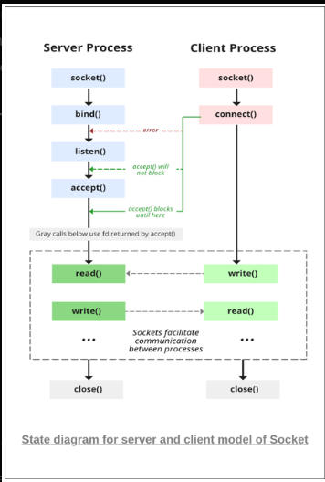
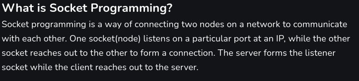
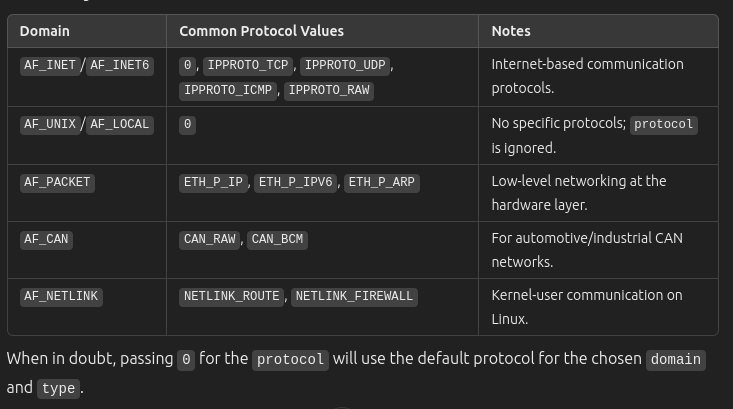
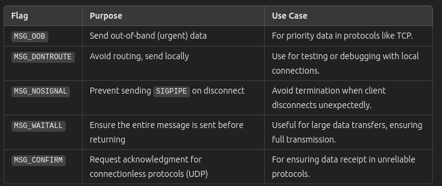

# HTTP-Server

Steps to cover : 
1. Create a socket
2. Bind the socket to an address
3. Listen on the address
4. Block on Accept until a connection is made
5. Read on the connected socket
6. Figure out how to respond
7. Write back on the connected socket
8. Close the connection
9. Go back to blocking on Accept



Let us move to **Step 1**
## How to Create a Socket in C

Before moving forward, let us understand what a "socket" is?



A socket is like a "doorway" for communication between processes or devices.

A socket can be created using sys/socket.h header file.

Let us start by initializing the socket first. To create a socket in C, you use the function:
```C
int sockfd = socket(domain, type, protocol)
```

Here,
- **sockfd**: This is a number (integer) that acts like a label for your socket. Think of it like a "file handle" for a file, but for communication instead of file operations.

- **domain**: integer,  This decides where the communication happens:

    - AF_LOCAL: Communication between processes on the same computer (POSIX standard).
    - AF_INET: Communication using IPv4 (e.g., between devices over a network).
    - AF_INET6: Communication using IPv6.

- **type**: This decides how data is sent:
    - SOCK_STREAM: Uses TCP, which ensures data arrives in order and without errors (reliable, connection-oriented).
    - SOCK_DGRAM: Uses UDP, which is faster but doesn’t guarantee reliability or order (unreliable, connectionless).
- **protocol**: Usually set to 0, it specifies the protocol used within the chosen domain. For example, in AF_INET, 0 defaults to IP.

### A little more on Sockets

The value of sockfd (the socket file descriptor) depends on the success or failure of the socket() function call:

- If the socket() function call is **successful**, sockfd will be a **positive integer**. It represents the file descriptor for the newly created socket. File descriptors typically start from 0 and increase, *but 0 is usually reserved for standard input (stdin)*, so a socket's file descriptor will generally be **1 or higher**.
- If the socket() function call **fails**, it **returns -1**. This indicates an error, and you should check errno (a global variable) to determine the reason for the failure.

More details about the Protocol part:


Now Let us move to **STEP 2** 
## Binding the socket to an address

Binding a socket to an address means associating it with a specific IP address and port so it can send and receive data. This is especially important for server sockets, as clients need to know where to connect.

So first we need to set up the address structure.
The *sockaddr_in* structure is used to specify the socket's address properties, such as IP address, port, and address family for IPv4.

For IPv6, the address structure is struct sockaddr_in6 instead of struct sockaddr_in. This structure is used to store IPv6 addresses and associated information.

To define and initialize the sockaddr_in structure:
```C
struct sockaddr_in server_addr;

memset(&server_addr, 0, sizeof(server_addr)); //This clears the structure
// Before initializing the structure, clear its memory to avoid leftover garbage values that might cause undefined behavior

server_addr.sin_family = AF_INET;            // IPv4
server_addr.sin_port = htons(PORT);          // Port number (use htons for network byte order)
// When you set the port number in sockaddr_in, remember to use htons() to ensure the port is in network byte order.

// To Bind to a Specific IP Address
// server_addr.sin_addr.s_addr = inet_addr("127.0.0.1"); 

// To Bind to All Available Interfaces
server_addr.sin_addr.s_addr = INADDR_ANY;    // IP address (localhost in this case)
// INADDR_ANY allows the socket to listen on all available network interfaces 
// (e.g., 127.0.0.1 for localhost and any other assigned IP addresses).

```


Once the socket is created and the address structure (sockaddr_in) is defined, the next step is to bind the socket to a specific address and port. This is done using the bind() function.

The function prototype is:
```C
int bind(int sockfd, const struct sockaddr *addr, socklen_t addrlen);

```

Here,
- **sockfd**: The socket file descriptor returned from the socket() function. This identifies the socket you want to bind.
- **addr**: A pointer to a struct sockaddr (usually struct sockaddr_in for IPv4) that contains the address to bind the socket to. This structure typically includes the IP address and port number.
- **addrlen**: The size of the address structure (struct sockaddr_in), which is typically sizeof(struct sockaddr_in). This tells the bind() function how much memory to read when accessing the address information.

Now Lets Move to **STEP 3**
## Listen on the Address

Once a socket is bound to an address and port using the bind() function, the next step is to prepare the socket to accept incoming connections. This is done using the listen() function.

It can be done using:
```C
int listen(int sockfd, int backlog);
```
- It puts the server socket in a passive mode, where it waits for the client to approach the server to make a connection. 

- The backlog, specifies the maximum number of pending connections that can be queued up before the system starts rejecting new connection requests. 

- If the queue reaches its limit and a new connection attempt is made, the client might receive an error such as ECONNREFUSED, which indicates that the server cannot accept any more connections at that time.

When a server calls listen(), it transitions the socket into a *passive mode*, which means that the server is no longer attempting to establish connections but instead is waiting for incoming connection requests from clients.

After calling listen(), the server is effectively saying, *"I'm ready to accept incoming connections."* It waits for clients to attempt to connect to the server.

Now Lets us move to **STEP 4**
## Block on Accept until a connection is made
So you might be wonder What does *"block on accept until a connection is made"* mean?

Blocking means that the server will wait for something to happen before it can continue its work. In this case, the server is waiting for a client to connect to it.

When the server calls the accept() function, it enters a waiting state (or "blocks"). It will stay in this state until a client connects. Once a client tries to connect, accept() will return, and the server can start communicating with that client.

In simpler words,
Imagine you are a receptionist at an office. You are waiting for visitors (clients) to walk up to the desk. You don't keep walking around looking for people—you just wait until someone comes up to you. Once a person arrives, you can start talking to them (communicating).

In the same way, the server is "waiting" for a client to "arrive" before it can start doing anything.

- accept() is used after the server has called listen() on the socket. It accepts an incoming connection request from a client.
- The server blocks at the accept() call until a client attempts to connect.
- Once a connection request is received, the accept() function returns a new socket descriptor that represents the communication channel with the client.
- The server can then use this new socket descriptor to send and receive data with the client.

```C
accept(server_fd, (struct sockaddr*)&address,&addrlen)
```

Now Lets move to **STEP 5**
## Read on the connected socket

Once the connection between the client and server has been established, the server can start reading data from the client. 

This is typically done using the read() function on the socket that was returned by accept(). The read() function reads data sent by the client over the established connection.

```C
valread = read(new_socket, buffer, 1024 - 1); // subtract 1 for the null terminator at the end
printf("%s\n", buffer);
```

Here,
- **buffer**: This is a character array (or buffer) that holds the data read from the socket. The server will store the incoming data here.
- **1024-1**: The read() function reads up to the number of bytes specified. The buffer size is 1024, but we subtract 1 to ensure there’s space for the null terminator \0, which is required to mark the end of the string.
- **read() function**: This reads up to 1024 bytes (or whatever you specify as the second argument) from the new_socket into the buffer. It returns the number of bytes read, which is stored in *valread*. If the return value is 0, it means the client has closed the connection. If it's -1, it indicates an error.


Now Lets move to **STEP 6**
## Figure out how to respond
Since we are only responding with a string for now. So lets move forward.

Now Lets move to **STEP 7**
## Write back on the connected socket

In STEP 7, your goal is to respond to the client after successfully receiving data from them. This involves sending a message back to the connected socket using the send() function.

In C, you can use the send() function to send data through a socket:
```C
ssize_t send(int sockfd, const void *buffer, size_t len, int flags);
```

Here, 
- **buffer**: The buffer that holds the data you want to send (this could be a string, like "Hello").
- **len**: The length of the data (usually, the length of the string or buffer).
- **flags**: Typically set to 0 for no special behavior (other values can be used for different socket behaviors, but 0 is standard for a basic send).

Other flags, we can use are:



And Finally **STEP 8** and **STEP 9**
## Close the connection and Go back to blocking on Accept

